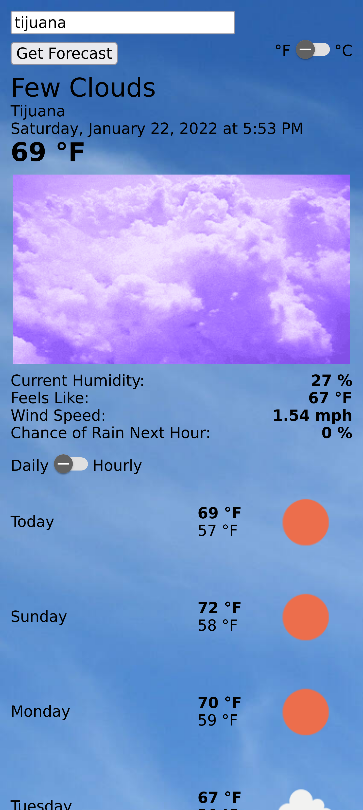

# Readme
# Weather App

## Overview

A Weather app which shows the current weather, as well as an hourly and daily 
forecast for any city searched by the user.  As an added bonus, the description of
the current weather is used to search for an animated gif which is displayed to
the user.  The gifs often turn out to be a bit crazy! The app is built with a 
responsive design so that it displays properly on any size viewport.

### Challenge

The design requirements which are detailed in the Weather App project page of 
The Odin Project [here](https://www.theodinproject.com/paths/full-stack-javascript/courses/javascript/lessons/weather-app).  The basic idea was to create an app which 
fetched data from a third-party API.  My app actually connects to two APIs.

### Screenshot

  

### Links

- [Live site](https://mattdimicelli.github.io/weather-app/)
- [Repo](https://github.com/mattdimicelli/weather-app)

## My process

### Built with
- Vanilla JS, CSS, and HTML
- A Switch component from Google Material Design
- Babel as dependency of Material Design
- Custom-made webpack config and build using loaders, plugins such as HTML Webpack Plugin, autoprefixer, and top-level await option
- ESLint, Stylelint, and HTMLHint static testing
- npm scripts
- Mobile-first, responsive design via media queries and Flexbox
- Fetch API for http requests
- Open Weather Map API (from openweathermap.org)
- The "Translate Endpoint" of Giphy API (api.giphy.com), which "converts words 
and phrases to the perfect GIF or Sticker using GIPHY's special sauce algorithm"

### What I learned

This was probably the first app in which I conntected to a third-party API 
endpoint, so I learned about API keys, such as some of the basic security concerns,
such as the need to secure a non-public API key.  This project also inspired
me to learn more about http requests in general, and on even more of a macro 
scale, *how the internet works*.  I took some well-spent time off from this project
to read up on these subjects.

One detail that piqued me interest in this project were the toggle switches.
I was surpised to learn that neither HTML (nor CSS) has a built-in implementation
or solution.  At first, attempting to *not* introduce another library into the app,
I altered some CSS taken from a W3School online lesson in order to "convert" an 
`<input type="checkbox">` into a toggle switch.  However, when I was manually 
testing the app's functionality, I was surprised to notice that the toggle switch
had variable functionality in different major web browsers.  So I decided to go 
for a more robust solution, and that led me to my first use Material Design.

